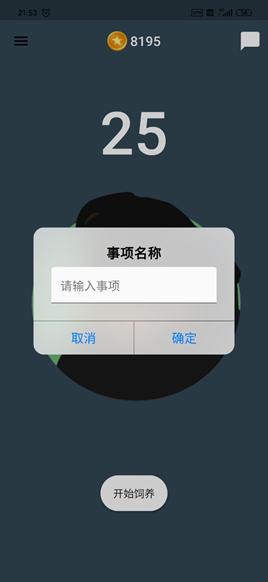

# Doghouse

The APP is a time management APP based on Flutter & Firebase. Improve users productivity at work and study by timekeeping.

The main functions include:

- HomePage
- Timekeep & tag
- DogHousePage
- FriendPage
- StorePage
- SettingPage

## Function

### HomePage

This page is the initial screen of the program after login. It includes the main page and the sidebar.

#### Main Page:

#### Sidebar:

### Timekeep & tag

Timekeeping and tagging are the main features of the app. You can select the duration and the tags.

#### Time Selecting

#### Tag Selecting

#### Timekeeping

### DataPage

Charting user timekeeping habits.

### DogHousePage

Display the entrys with reversible cards. Click on the card to turn it over.

### FriendPage

You can add friends and compare times by leaderboard.

### StorePage

Users can earn coins by timing and can unlock more pets in the store.

### SettingPage

Users can change their password, change their username and log out.

## Getting Started

This project is a starting point for a Flutter application.

A few resources to get you started if this is your first Flutter project:

- [Lab: Write your first Flutter app](https://flutter.dev/docs/get-started/codelab)
- [Cookbook: Useful Flutter samples](https://flutter.dev/docs/cookbook)

For help getting started with Flutter, view our
[online documentation](https://flutter.dev/docs), which offers tutorials,
samples, guidance on mobile development, and a full API reference.
